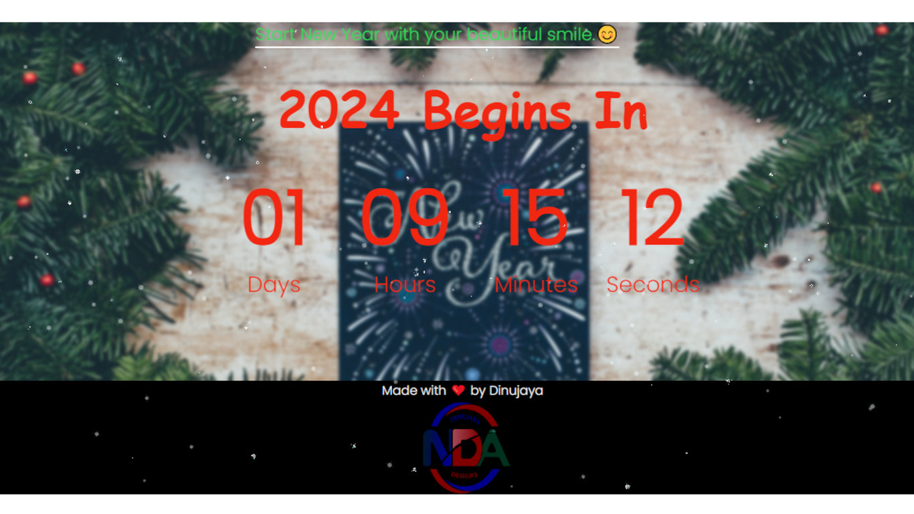

# Time Till NewYear



Time Till NewYear is a lightweight web application that displays a countdown to the next New Year's Eve celebration. Built with HTML, CSS, and JavaScript, it offers a simple and visually appealing way to track the time until the start of the new year.

## Features

- **Real-Time Countdown:** Watch the seconds, minutes, and hours countdown to the New Year.
- **Customizable Themes:** Choose from a variety of themes to personalize your countdown experience.
- **User-Friendly Interface:** Easy-to-use design for an enjoyable user experience.

## Usage

1. Clone the repository:

   ```bash
   git clone https://github.com/dinujaya67/Time-Till-New-Year.git
